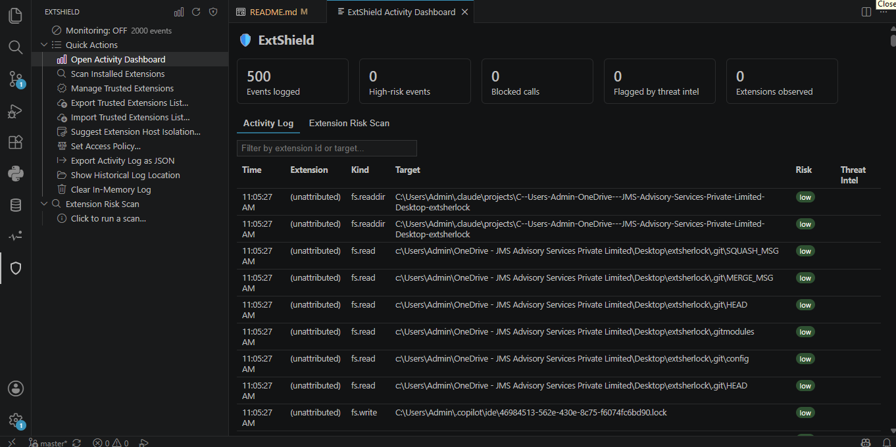
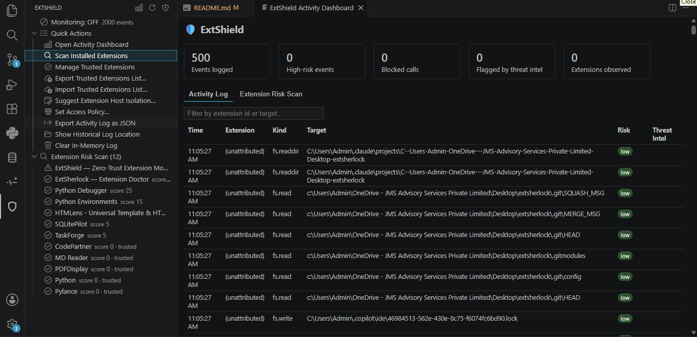
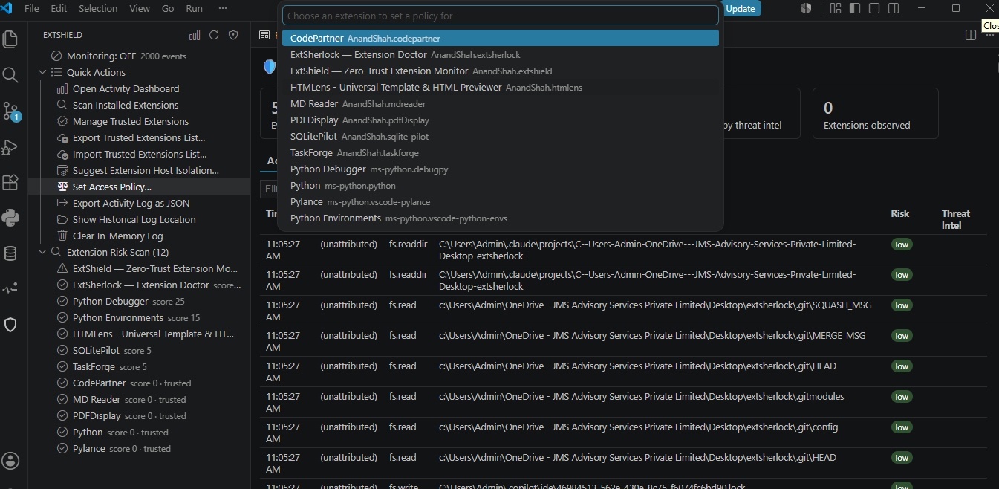
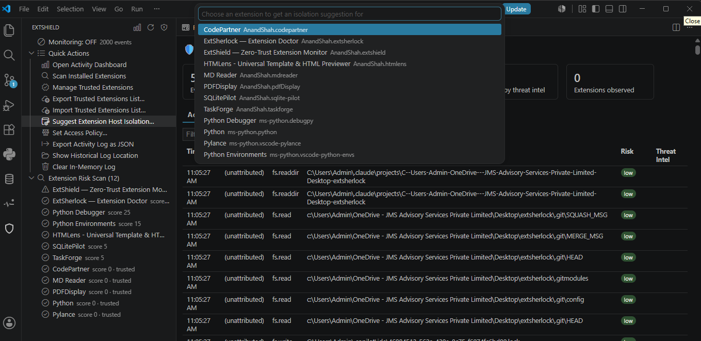
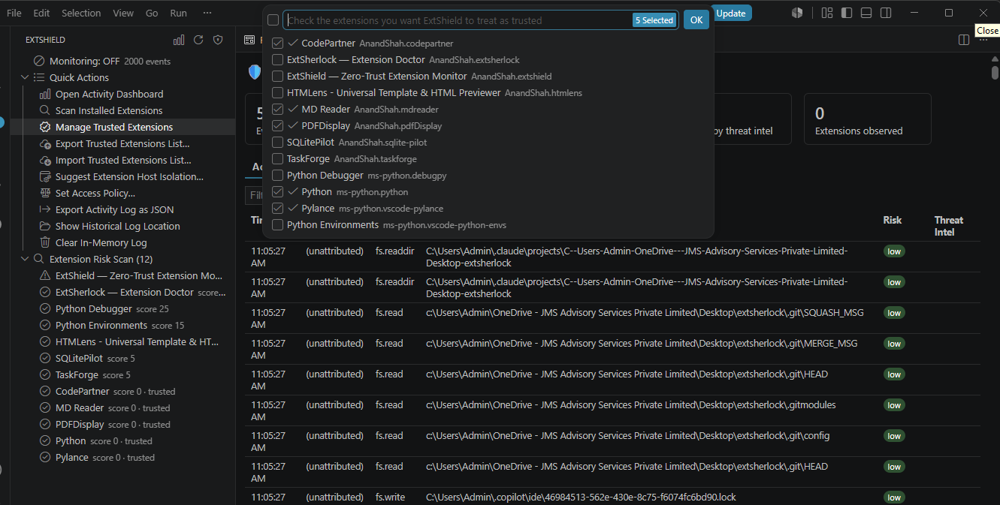
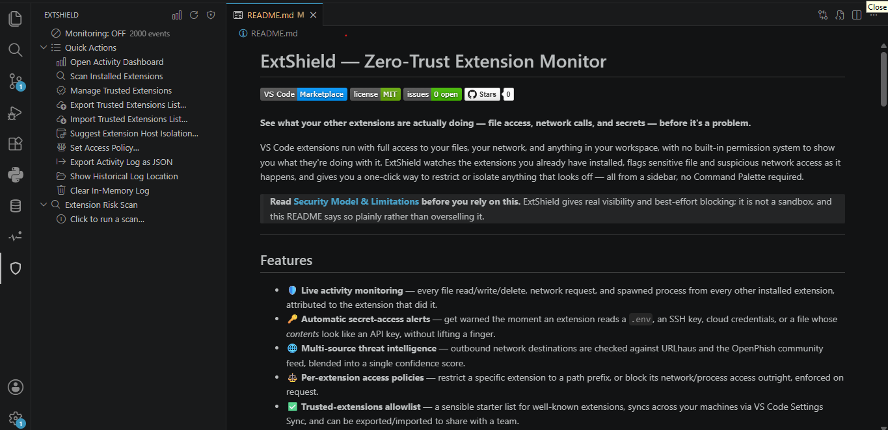

# ExtShield — Zero-Trust Extension Monitor

**See what your other extensions are actually doing — file access, network calls, and secrets — before it's a problem.**

VS Code extensions run with full access to your files, your network, and anything in your workspace, with no built-in permission system to show you what they're doing with it. ExtShield watches the extensions you already have installed, flags sensitive file and suspicious network access as it happens, and gives you a one-click way to restrict or isolate anything that looks off — all from a sidebar, no Command Palette required.

> **Read [Security Model & Limitations](#security-model--limitations) before you rely on this.** ExtShield gives real visibility and best-effort blocking; it is not a sandbox, and this README says so plainly rather than overselling it.

---

## 📸 Screenshots

### Sidebar

### Activity Dashboard

Monitor file access, network requests, process launches, and secret access from all installed extensions in one place.

### Risk Scanner

Every installed extension is scored using heuristic analysis with detailed explanations for each risk factor.

### Access Policy Manager

Restrict an extension's filesystem access, block network requests, or disable process spawning with per-extension policies.

### Extension Isolation Suggestions

When using Remote-SSH, Dev Containers, or WSL, ExtShield can recommend moving high-risk extensions into a separate extension host.

### Trusted Extensions

Manage your allowlist, import/export it, and sync trusted extensions using VS Code Settings Sync.

Access monitoring, policy management, trusted extensions, and activity logs directly from the Activity Bar.

---

## Features

- 🛡️ **Live activity monitoring** — every file read/write/delete, network request, and spawned process from every other installed extension, attributed to the extension that did it.
- 🔑 **Automatic secret-access alerts** — get warned the moment an extension reads a `.env`, an SSH key, cloud credentials, or a file whose *contents* look like an API key, without lifting a finger.
- 🌐 **Multi-source threat intelligence** — outbound network destinations are checked against URLhaus and the OpenPhish community feed, blended into a single confidence score.
- ⚖️ **Per-extension access policies** — restrict a specific extension to a path prefix, or block its network/process access outright, enforced on request.
- ✅ **Trusted-extensions allowlist** — a sensible starter list for well-known extensions, syncs across your machines via VS Code Settings Sync, and can be exported/imported to share with a team.
- 🖥️ **One-click isolation suggestions** — when you're connected to Remote-SSH/Dev Containers/WSL, ExtShield can push a risky extension into that separate process for you, automatically surfacing the suggestion for anything that scores high enough.
- 📊 **Manifest-based risk scan** — every installed extension gets a heuristic risk score with the specific reasons behind it.
- 💾 **Persistent history** — the activity log survives restarts and is fully exportable as JSON.
- 🧭 **A real sidebar, not just commands** — a dedicated Activity Bar view with a status toggle, one-click actions, and an actionable risk list. See [Getting Started](#getting-started).

## Getting Started

1. Install the extension. A shield icon appears in the **Activity Bar**.
2. Click it — monitoring starts automatically, no configuration needed.
3. Click **Scan Installed Extensions** in the sidebar to see a risk-ranked list of everything you have installed.

That's the whole setup. Everything below is available directly from that sidebar view: a status row you click to toggle monitoring, a list of one-click actions (dashboard, scan, trust management, policy, log export), and a risk list where each row has inline buttons to set a policy, toggle trust, or get an isolation suggestion.

Prefer a bigger view? **ExtShield: Open Activity Dashboard** opens a full tab with a filterable, color-coded activity log and the same risk-scan list with more room to work.

## Requirements

- VS Code `1.85.0` or later.
- No other dependencies — ExtShield works out of the box on any workspace.
- Outbound network access to `urlhaus-api.abuse.ch` and `openphish.com` is needed for live threat-intel checks; without it, ExtShield falls back to a small static watch-list automatically.
- The one-click isolation feature only does something useful when you're connected via Remote-SSH, Dev Containers, or WSL — see [Security Model & Limitations](#security-model--limitations).

## Extension Settings

This extension contributes the following settings (`Ctrl/Cmd+,` → search "ExtShield"):

| Setting | Default | Description |
|---|---|---|
| `extshield.enabled` | `true` | Master on/off switch for monitoring |
| `extshield.blockOnPolicyViolation` | `false` | Actually enforce configured policies (block), not just log violations |
| `extshield.monitorEnvAccess` | `false` | Experimental: log which extension reads which environment variable name |
| `extshield.notifyOnSecretAccess` | `true` | Pop a warning when a sensitive file or content pattern is detected |
| `extshield.logRetentionEntries` | `2000` | Max in-memory/dashboard activity log entries |
| `extshield.diskLogRetentionDays` | `30` | Days of on-disk history kept; `0` keeps forever |
| `extshield.threatIntel.enabled` | `true` | Check contacted hosts against URLhaus + OpenPhish |
| `extshield.threatIntel.cacheTtlMinutes` | `60` | How long to cache a host's threat-intel result |
| `extshield.autoSuggestIsolationThreshold` | `70` | Risk score (0-100) at which ExtShield proactively suggests isolation; `0` disables proactive suggestions |

## Commands

Everything is also reachable from the Command Palette (`Ctrl/Cmd+Shift+P`) if you prefer typing over clicking:

`ExtShield: Open Activity Dashboard` · `Scan Installed Extensions for Risk` · `Set Access Policy for an Extension` · `Manage Trusted Extensions Allowlist` · `Export/Import Trusted Extensions List` · `Suggest Extension Host Isolation` · `Toggle Monitoring On/Off` · `Clear Activity Log` · `Export Activity Log as JSON` · `Show Historical Log File Location`

## Security Model & Limitations

**Please read this section.** VS Code has no built-in permission system or sandbox for extensions — every extension shares one process and one set of Node.js built-ins, with no OS-level isolation between them. ExtShield works by monitoring those shared built-ins (`fs`, `http`/`https`, `child_process`) and using the call stack to attribute activity back to the extension that triggered it. That's real, useful visibility and a best-effort blocking layer — **it is not a true sandbox**, and here's specifically why:

- A sufficiently motivated extension can bypass monitoring entirely — native addons, worker threads, bundled copies of Node's core modules, or code that grabs function references before ExtShield activates.
- Web Extensions (running in a browser Worker, e.g. on vscode.dev) aren't covered — there's no shared Node process there to monitor.
- Policy enforcement only blocks calls that pass through the specific patched entry points; anything reaching the OS a different way isn't caught.
- Attribution is best-effort. When ExtShield can't confidently attribute an action to a specific extension, that action is logged as "(unattributed)" and policies are **not** enforced against it — it fails open by design, so a monitoring gap can't accidentally break an unrelated extension.
- Risk scores are static, manifest-based heuristics — a prioritization signal for what to look at first, not a verdict. A high score doesn't mean malicious; a low score doesn't guarantee safe.
- Threat-intel results reflect whether a host has been *reported*, not whether *this specific connection* was malicious, and the check happens after the connection already went out — it informs review and alerting, not real-time blocking.
- Isolation suggestions only do something when you're already connected to a Remote-SSH/Container/WSL target, because that's the only setup where VS Code actually gives you a second, separate process to move an extension into. Without one, ExtShield tells you so plainly instead of pretending to isolate anything.

Think of ExtShield as a network monitor or audit log for your extensions: excellent for visibility and for catching sloppy or obviously bad behavior, not a guarantee against a sophisticated, determined attacker.

## Privacy & Data

- Activity data (file paths, hostnames, commands) stays local, written to your own machine's extension storage — never sent anywhere by ExtShield itself.
- Threat-intel checks send only the **hostname** being contacted (not full URLs, paths, or payloads) to URLhaus (abuse.ch) and OpenPhish, two independent free community services, purely to check reputation. This can be disabled entirely via `extshield.threatIntel.enabled`.
- Your trusted-extensions list may sync across your own machines via VS Code's built-in Settings Sync, if you have that enabled — this is VS Code's mechanism, not a separate ExtShield service.

## Known Issues

- Stack-trace attribution can occasionally miss extremely deferred or deeply async call chains, showing "(unattributed)" instead of a specific extension.
- The static threat-intel watch-list is illustrative and small; it is not a substitute for the live URLhaus/OpenPhish checks.
- If you find an extension behaving in an unexpected way that ExtShield doesn't explain well, please open an issue with the "ExtShield" output channel contents attached (`ExtShield: Show Output Channel`).

## Release Notes

See [CHANGELOG.md](CHANGELOG.md) for version history.

### 0.1.0
Initial release: activity monitoring, secret detection, per-extension policies, multi-source threat intel, trusted-extensions allowlist with sync/export, isolation suggestions, and the Activity Bar sidebar.

## Contributing

Found a bug or have an idea? Issues and pull requests are welcome on the project's repository. See [`CONTRIBUTING.md`](CONTRIBUTING.md) for build instructions and [`DEVELOPMENT.md`](DEVELOPMENT.md) for architecture, debugging, and how to extend the monitoring system.

## Support & Issues

If you encounter any issues or have suggestions, please report them on the [Issues page](https://github.com/AnandShah10/extShield/issues).

## Publisher Information

- **Name**: Anand Shah
- **GitHub**: [@AnandShah10](https://github.com/AnandShah10)
- **Email**: [shahanand1072004@gmail.com](mailto:shahanand1072004@gmail.com)

## License

This project is licensed under the MIT License - see the [LICENSE](LICENSE) file for details.

---

*Built with ❤️ for the VS Code community by Anand Shah.*